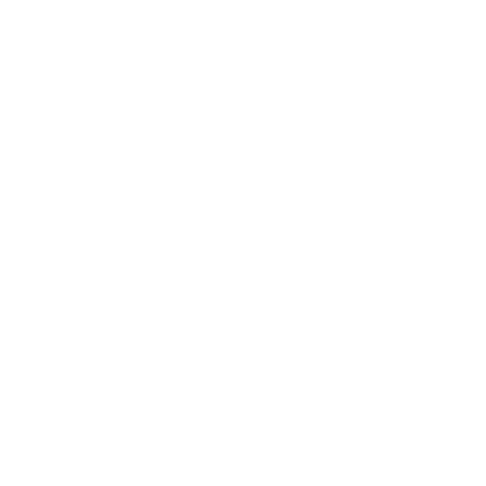

 
 <h1 align="center">Neuron Browser</h1>
 
Extremely powerful, super-fast, bloat-free Browser coded in C#

  

    
    
    
    
  

<h1></h1>

## Usage:
 - Download latest release and extract it to any folder. Make sure you download the right one for your architecture!
 - Create a shortcut to `Neuron.exe` and place it anywhere.
 - Have Fun!

## Building (Somewhat working, still complicated.)
If you are planning on building this project in Visual Studio, some extra packages will be needed.

Navigate to the **NuGet Package Manager**, select the browse tab, and install the following packages. I can't include them here because I can't be bothered to learn GitLFS to upload large files.
 
 - CefSharp **90.6.50**
 - Aspose.Zip **21.4.0**
 - Svg **2.4.3**
 - EasyTabs **2.0.0**
 - DotNetZip **1.15.0**
 - TitleBarTabs **1.2.0.0**
 - System.Drawing.Common **4.5.1**
 - System.IO.Compression **4.3.0**
 - System.IO.Compression.ZipFile **4.3.0**

*Building also requires a reference to `Siticone.UI.dll`*

## Credits:

 - CefSharp - [**Google LLC**](https://en.wikipedia.org/wiki/Google)
 - Siticone UI - [**Siticone**](https://siticoneframework.com)
 - Aspose.Zip - [**Aspose**](https://www.aspose.com/)
 - .NET SVG - [**SVG**](https://www.nuget.org/packages/Svg/)
 - EasyTabs - [**lstratman**](https://github.com/lstratman/EasyTabs)
 - DotNetZip - [**Henrik Feldt**](https://www.nuget.org/packages/DotNetZip)
